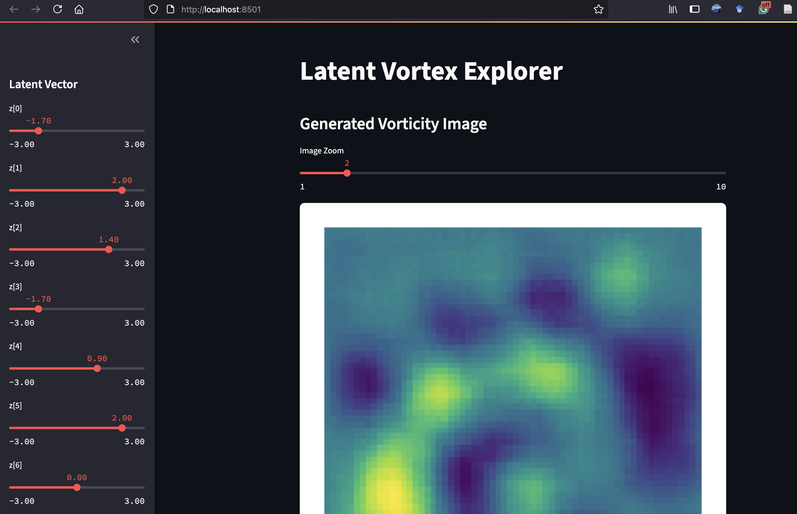

# VAE Vortex Explorer

A Streamlit-based app to explore the latent space of a Variational Autoencoder (VAE) trained on synthetic 2D vorticity-like images.

## Features

- Real-time exploration of latent space with sliders
- Generates fluid-inspired vortex images
- Built with PyTorch and Streamlit
- Lightweight and runs locally or on Streamlit Cloud

## Installation

Clone the repository and create a virtual environment:

```bash
git clone https://github.com/yourusername/vae-vortex-explorer.git
cd vae-vortex-explorer
python3 -m venv vae_env
source vae_env/bin/activate  # On Windows use: vae_env\Scripts\activate
pip install -r requirements.txt
```

## Usage

1. Generate the dataset:
```bash
python generate_data.py
```

2. Train the VAE:
```bash
python train_vae.py
```

3. Launch the Streamlit app:
```bash
streamlit run app.py
```

Then open your browser to `http://localhost:8501`.

## Project Structure

```
vae-vortex-explorer/
├── app.py                 # Streamlit interface
├── generate_data.py       # Generate vortex fields
├── train_vae.py           # VAE training script
├── vae_vortex.pt          # Trained model weights
├── requirements.txt
└── README.md
```

## Dependencies

- Python 3.8+
- torch
- torchvision
- streamlit
- numpy
- matplotlib

All installable via `pip install -r requirements.txt`.

## Preview

```markdown

```

## Future Ideas

- Interpolation between latent vectors
- Upload and encode your own flow field
- Use real CFD or JHTDB data instead of synthetic
- Save generated images to file

## Author

Karan Anand, PhD

## License

MIT License

